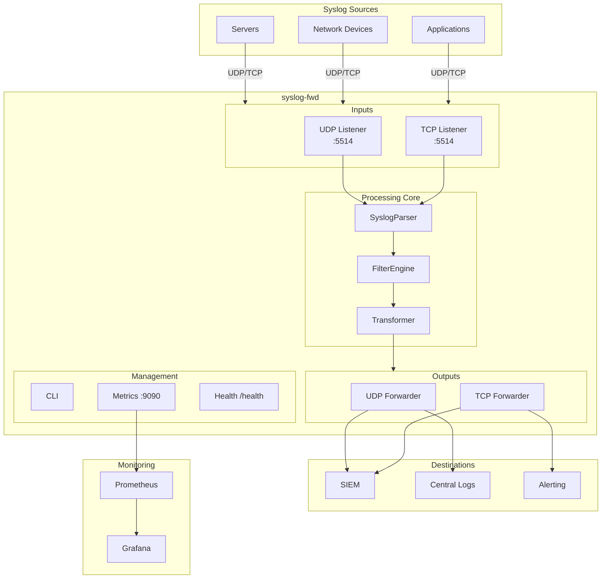
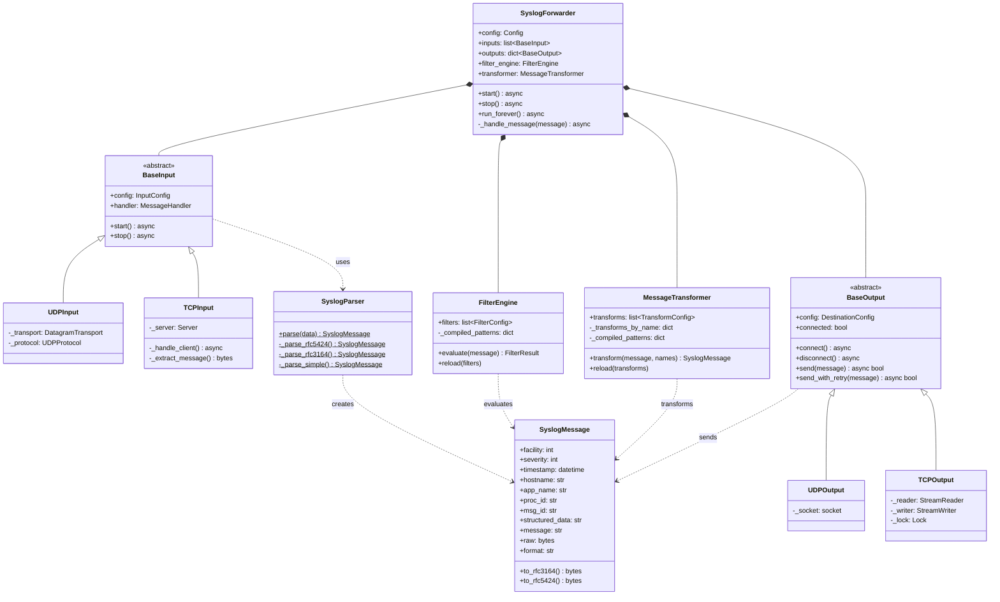
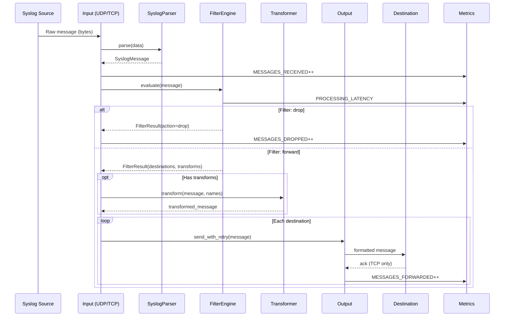
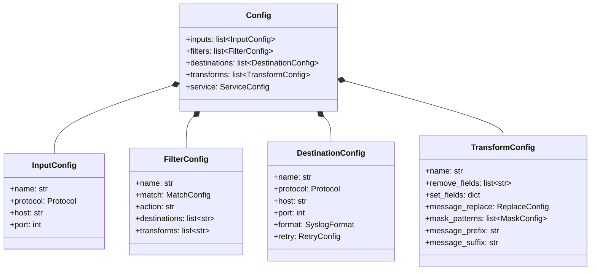
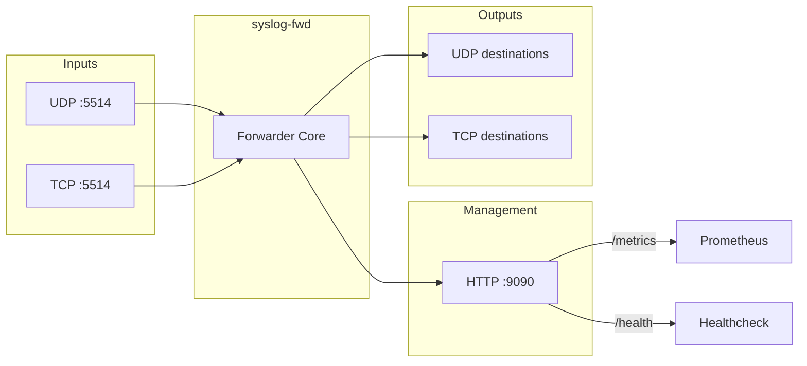

# Syslog Forwarder - Architecture

## Overview
Syslog-fwd is an async Python service that receives, filters, transforms, and forwards syslog messages. Built on asyncio for high-performance message processing.

## High-Level Architecture

## Component Model

## Data Flow

## Component Details

### CLI (`cli.py`)
Entry point using Click framework.

| Command | Description |
|---------|-------------|
| `run` | Start the forwarder service |
| `validate` | Validate configuration file |
| `simulate` | Test message against filters |
| `init` | Generate example configuration |
| `export` | Convert config to syslog-ng format |

### Config (`config.py`)
Pydantic models for configuration validation.

### Parser (`parser.py`)
Parses raw syslog messages into structured `SyslogMessage` objects.

Supported formats:
- **RFC 5424**: Modern syslog format with structured data
- **RFC 3164**: Legacy BSD syslog format
- **Simple**: Minimal format with PRI only

### Inputs (`inputs.py`)
Async listeners for receiving syslog messages.

| Class | Protocol | Features |
|-------|----------|----------|
| `UDPInput` | UDP | Stateless, fire-and-forget |
| `TCPInput` | TCP | Connection tracking, RFC 6587 framing |

### Filters (`filters.py`)
First-match-wins filter engine.

Match criteria:
- Facility (kern, user, mail, etc.)
- Severity (emerg, alert, crit, etc.)
- Hostname pattern (regex)
- Message pattern (regex)

### Transformer (`transformer.py`)
Message transformation operations.

| Operation | Description |
|-----------|-------------|
| `remove_fields` | Remove specific fields |
| `set_fields` | Set fields to values |
| `message_replace` | Regex replacement in message |
| `mask_patterns` | Mask sensitive data |
| `message_prefix/suffix` | Add prefix/suffix to message |

### Outputs (`outputs.py`)
Async forwarders with retry logic.

| Class | Protocol | Features |
|-------|----------|----------|
| `UDPOutput` | UDP | Non-blocking socket |
| `TCPOutput` | TCP | Connection pooling, timeout |

### Metrics (`metrics.py`)
Prometheus metrics exported at `/metrics`.

| Metric | Type | Description |
|--------|------|-------------|
| `syslog_messages_received_total` | Counter | Messages received by protocol/facility/severity |
| `syslog_messages_forwarded_total` | Counter | Messages forwarded by destination |
| `syslog_messages_dropped_total` | Counter | Messages dropped by reason |
| `syslog_processing_latency_seconds` | Histogram | Filter evaluation time |
| `syslog_destination_up` | Gauge | Destination health (0/1) |
| `syslog_active_connections` | Gauge | Active TCP connections |

## External Interfaces

## Technology Stack

| Component | Technology |
|-----------|------------|
| Runtime | Python 3.10+ |
| Async | asyncio |
| Config | Pydantic |
| CLI | Click |
| Logging | structlog |
| Metrics | prometheus_client |
| Package | uv |
